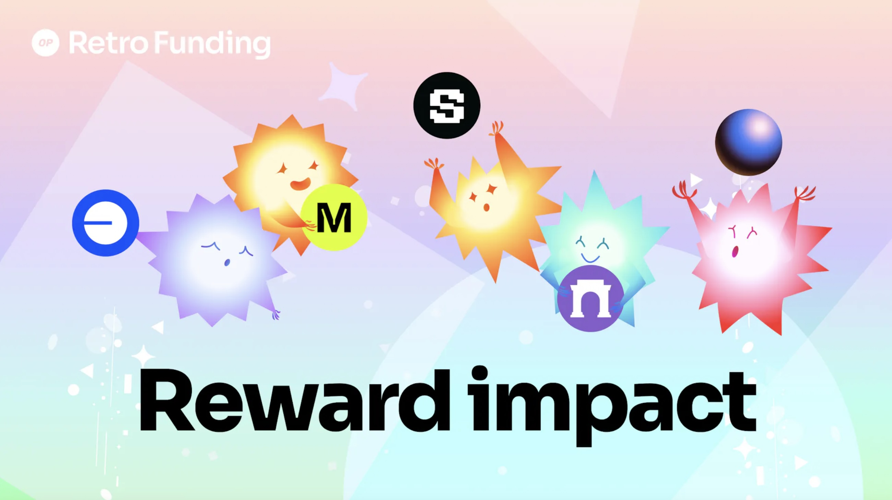

Retroactive Public Goods Funding (Retro Funding) is based on the idea that it’s easier to agree on what was useful in the past than what might be useful in the future. This is a series of experiments where members of the Citizens’ House allocate surplus protocol revenue or portions of the Retro Funding token allocation to projects they deem have provided positive impact to the Optimism Collective and across the Superchain. This is core to Optimism’s value of impact=profit: the idea that   positive impact to the collective should be rewarded proportionally with profit to the individual.

These rewards create strong incentives for people to build public goods that benefit the Optimism Collective. The aggregate effect is an ecosystem that is easier to build on, learn about, and connect to, in turn driving application usage and generating more demand for blockspace. By funding public goods sustainably, the Collective can create a rich ecosystem and a better economy.

Retro Funding also provides possible exit liquidity for public goods projects, which opens up a market for early investment in those projects. This means builders can:

* Be rewarded for their positive contributions without generating direct revenue
* Raise capital to bootstrap based on the early potential and promise of their project

# A Commitment to Experimentation

Retro Funding is a long term bet to build the future Optimists want to see. The Collective will conduct regular rounds of Retro Funding, each different from the last. This is an emergent process that will take community participation to grow and prune.

* Retro Funding round 1 took place at the end of 2021 and allocated $1 million across 58 projects.
* Retro Funding round 2 took place in Q1 2023 and allocated 10m OP tokens across 195 projects.
* Retro Funding round 3 took place in Q4 2023 and allocated 30m OP tokens across 501 projects.
* Retro Funding round 4 will take place in Q2/3 2024 and will reward onchain builders who contribute to the success of Optimism.
* Sign up for future rounds at [retrofunding.optimism.io](https://retrofunding.optimism.io/).

# Experimentation Framework
Retro Funding has three core components, each with substantial surface area for experimentation.

* Impact scoping: what should the Collective fund? How is it defined and decided on?
* Impact scoring: how does the Citizens’ House evaluate impact? What units, process, or tools do we use?
* Impact settlement: how does voting work?

For the first several rounds of Retro Funding, the Optimism Foundation will decide on scope and voting mechanics with input from the community. Eventually the set of variables around what to fund, how much to fund, and how to vote will be up to the Citizens’ House, with checks and balances from the Token House. You can read more about the [Path to Open Metagovernance here](https://gov.optimism.io/t/the-path-to-open-metagovernance/).

Over time, the Collective aims to expand the scope of Retro Funding to support the production of public goods beyond the immediate Optimism ecosystem. To get there, we must refine the tools and processes used for Retro Funding based on regular experimentation.

# Past Rounds
- [RetroPGF Round 3](https://community.optimism.io/docs/governance/retropgf-3/)
- [RetroPGF Round 2](https://community.optimism.io/docs/governance/retropgf-2/)
- [RetroPGF Round 1](https://community.optimism.io/docs/governance/retropgf-1/#)