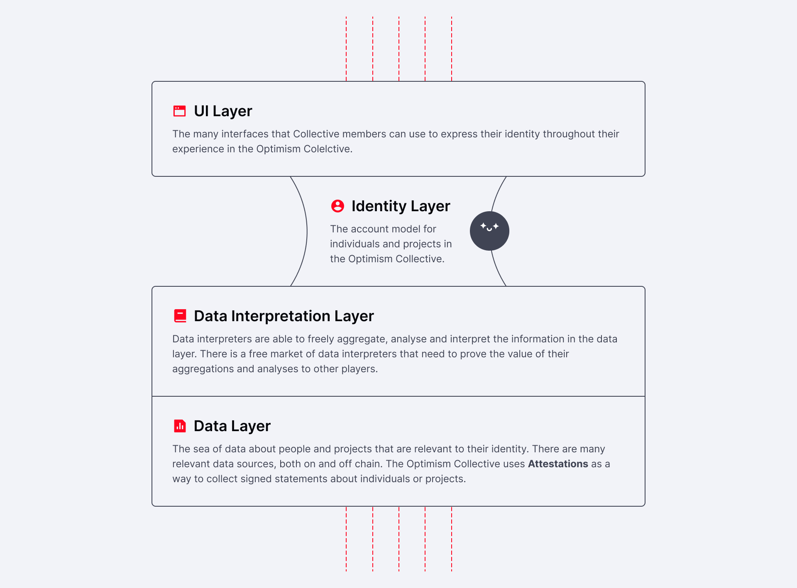

This document intends to open-source the Optimism Foundation’s thinking around identity and reputation within the Collective, as it relates to Citizenship. The hope is to provide some clarity and direction for community members who are curious or eager to build things that create impact for the Collective.

## Problem summary

We need robust user and project identity within the Optimism Collective as a foundation for Citizenship.This will improve the quality of Token House elections, better support developers on their journey of building on the superchain and create a high trust ecosystem. 

In our plan for how to get there, we need to avoid following known pitfalls:
* Products that on their own don’t solve a problem, don’t get adopted.
* Attestations aren’t valuable unless they are being consumed in a real use case.
* There may be a cold start or chicken-and-egg problem in bootstrapping an identity/reputation network.
* Defining the criteria for citizenship ‘top down’ and issuing related attestations misses an opportunity for emergent knowledge.
* Attestations issued for their own sake are at risk of being arbitrary - i.e. not representing anything meaningful for the Optimism Collective.

## Principles

* Prioritize the things that will help Citizenship emerge organically over defining Citizenship top-down.
* Issue attestations that will be used for something right away rather than issuing attestations for every little thing that might be useful in the future.
* When aggregating data, avoid arbitrary inputs and ensure there is a way to measure effectiveness.
* Design with the expectation that what is built will attract farmers.

See the ‘Attestations Best Practices’ section below for a practical guide to attestations.

## The identity stack framework

The identity stack framework helps us to see how the different elements of identity and reputation fit together. 

At the data layer, we have raw blockchain transactions, attestations and other types of data. The data producers can be dApps, organizations or individuals themselves. Anyone can produce any kind of data, but those higher up in the stack (such as data aggregators) need to differentiate signal from noise.

The data interpretation layer includes algorithms, aggregations and other kinds of analytics run across the data in the data layer. Data aggregators can but don’t need to be the same entities that produce or consume the data. In fact, in the future we can imagine a large marketplace of data aggregators that compete to provide the most valuable algorithms to other entities. Anyone can aggregate data, but they must prove their worth and trustworthiness to other players. In the future, metric-based impact evaluation for Retro Funding, smart defaults in the Token House and Citizenship selection are all areas where we imagine that data interpretation will become essential.

At the identity layer we have the way that individual users and projects/teams are represented in the Optimism Collective in order to tie together all the information about them. In the past, Ethereum addresses have been used to represent users and projects, but we are seeing limitations in this approach, as Ethereum addresses often do not stay stable over the lifecycle of a user or a project. The identity layer of the stack is the narrowest point - here having multiple competing offerings could become detrimental if one person’s identity is split across multiple accounts.

Finally, the UI layer includes any interface that integrates elements of the layers below - for example an interface that represents user profiles or a website that surfaces various algorithms that compute a user’s impact in the Optimism Collective. A multitude of interfaces is valuable and provides users different ways to engage with the layers below in the context of the user journey or the problem they are trying to solve.

## Now what?

We ought to take an approach of building out vertical slices of the identity stack, rather than building out sections horizontally. For example, rather than investing into building out all the possible use cases for data interpretation, we should select specific user problems and solve them end-to-end. Each vertical slice will solve a specific problem and integrate the necessary elements of the stack. This is the classic method of building an MVP and ensures that each piece that is built serves a purpose and gets adoption. It also means that attestations will be generated when they serve a specific need as part of a user journey, rather than being arbitrary. 

While we are not taking an approach of building all the layers horizontally, the Optimism Foundation will support the establishment of an opinionated identity data structure that others can build around. By forming an opinion on how individuals and projects are represented in the Collective, we will make it easier for others to contribute and interoperate. Stay tuned for more updates on this.

We recommend that others keen to build within the identity and reputation space in the Optimism Collective take an approach of solving a specific and real problem for a clearly-defined user group and consider how this relates to the various layers of the identity stack, while adopting a shared user and project identity structure.

For those seeking specific input and ideas on what the Foundation and Token House consider valuable work, please refer to the Builder Ideas List, and current Delegate Mission Requests and Foundation Mission Requests - these are the channels where specific work is called for.

If you’re working on something that you think fits within this framework and is not represented in these channels, please email identity@optimism.io and we’ll consider whether a Mission Grant could support this work.