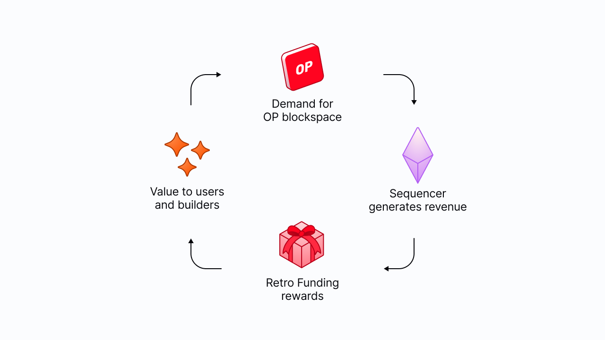
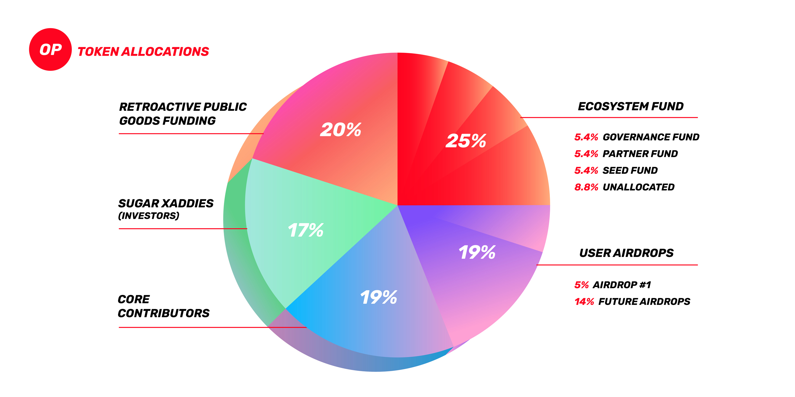

## OP Tokenomics

The Optimism Collective is based on the idea that healthy public goods create a thriving and valuable ecosystem. The economics of this ecosystem are designed to generate value for two constituencies:

- Sequencer revenue is primarily directed to fund public goods, which creates ecosystem value and drives demand for blockspace.
- Value accrues to **contributors and builders** directly from retroactive public goods funding and the markets it enables. Builders also benefit symbiotically: it’s better to build in an ecosystem with well-funded tools, education, apps, and infrastructure.
- Value accrues to **users and community members** from ongoing airdrops of OP, from project incentives made possible by OP ecosystem grants, and from the benefit public goods provide.

Together, it looks like this:

Let’s break it down ⤵️

## Demand for OP blockspace generates revenue

Rewards for the OP economy comes from ownership of OP Mainnet and the value of its blockspace. 

Today, rewards comes directly from the centralized sequencer, accruing to The Optimism Foundation for redistribution. In the future, rewards can accrue directly to the protocol by selling the right to participate in Optimism’s decentralized sequencing network.

Simply put: the right to blockspace is the sustainable source of revenue that drives OP’s economic model and grows with the network itself.

## Revenue is distributed to public goods

Communities benefit from all sorts of public goods, from education to city infrastructure to open source software. But many markets fail to provide adequate rewards and support for those public goods. 

It’s here that Optimism takes a step forward, by building a sustainable reward source into the mechanisms of the network itself.

Direct or auctioned sequencer revenue is distributed back to the ecosystem primarily through Retroactive Public Goods Funding ([Retro Funding](../citizen-house/how-retro-funding-works.md)).

This creates strong incentives for individuals to build for the public good of the Optimism Collective.

To start, the Citizens’ House will vote quarterly on distributions of grants to individuals, teams, projects, or communities that have provided subjective value over a specified time period. 
This directly rewards community members for the positive impact of their work.

Retro Funding also provides possible exit liquidity for public goods projects, which opens up a market for early investment in those projects. 

This means builders can:

- Be rewarded for their positive contributions without generating direct revenue.
- Raise capital to bootstrap based on the early potential and promise of their project.

In the long-term, the Foundation expects this mechanism to drive a wide range of pro-social downstream effects, which the Collective can capture and expand upon through frequent experimentation and iteration.

## Value from public goods drives demand for blockspace

Rewarding public goods drives growth — and therefore network revenues — from the ground up. 

In our [first round](https://vitalik.ca/general/2021/11/16/retro1.html) of RetroPGF, Optimism rewarded a set of hugely valuable developer tools and core infrastructure. The aggregate effect is an ecosystem that is easier to build on, learn about, and connect to, in turn driving application usage and generating more demand for blockspace.

But what value do these public goods provide, and for whom is it valuable? 

This is a rich design space. Optimism’s governance is designed to create conditions for experimentation around this question. 

The Foundation draws heavily on the work of Ostrom, Vitalik, and others to make sure rewards for public goods are maximally efficient, effective, and safe. 

To start, Foundation governance is shared and divided through a two-house system, where network parameters for the amount of rewards are controlled by both houses, but the governance of RetroPGF allocation is determined by a set of Citizens with local knowledge and skin in the game.

Thoughtful allocation of grants to public goods will create longterm value for builders, users, tokenholders, citizens and the entire Optimism Collective.

---

## OP Allocations

| Category | Percentage | Description |
| --- | --- | --- |
| Ecosystem Fund | 25% | The Ecosystem Fund is a proactive program meant to stimulate development in the Collective ecosystem by providing funding to projects and communities |
| Retroactive Public Goods Funding (RetroPGF) | 20% | RetroPGF is the Optimism Collective’s primary mechanism to adequately and reliably **reward** public goods for the impact they provide |
| User airdrops | 19% | A series of airdrops to reward users for specific helpful behaviors, beginning with Airdrop #1 |
| Core contributors | 19% | The people who’ve been working tirelessly to bring the Optimism Collective into existence |
| Sugar xaddies | 17% | Investors |

## User Airdrops

***Allocation: 19%***

The Optimism Foundation will allocate a portion of the OP allocation to members of the Optimism and Ethereum communities in multiple waves.

### Airdrop #1

The first user airdrop distributed **5%** of the OP token supply to **248,699 unique addresses.** 
This airdrop was targeted towards people who:

- Behave in positive-sum ways.
- Contribute actively to their communities.
- Have been priced out of Ethereum.

The addresses and amounts were chosen to reward Optimism users, as well as attract core Ethereum users to the OP family. 
Airdrop #1 cast a wide net to distribute OP to more than 250k addresses. 

See the [Airdrop #1 documentation](https://community.optimism.io/docs/governance/airdrop-1/) for a detailed breakdown of eligibility criteria.  

### Airdrop #2 

Optimism’s Airdrop #2 distributes **11,742,277.10 OP to 307,965 unique addresses** to reward **positive-sum governance participation** and **power users of OP Mainnet**. 
A snapshot of addresses was taken on 01-20-2023 0:00 UTC.

See the [Airdrop #2 documentation](https://community.optimism.io/docs/governance/airdrop-2/) for a detailed breakdown of eligibility criteria.  

### Airdrop #3

Airdrop 3 took place on Monday, September 18. The airdrop allocated **19,411,313 OP to 31,870 unique addresses.** Similar to Airdrop 2, this drop rewards **positive sum governance participation.** Users who have delegated tokens between 2023-01-20 at 0:00 UTC and 2023-07-20 0:00 UTC received tokens in this airdrop. A bonus is given to addresses who delegated to a delegate who voted in Optimism Governance. 

See the [Airdrop #3 documentation](https://community.optimism.io/docs/governance/airdrop-3/) for a detailed breakdown of eligibility criteria. 

### Airdrop #4

Airdrop 4 took place on Feb 20, 2024, and distributed **10,343,757.81 OP to 22,998 unique addresses.** This Airdrop was a **‘thank you’ to the artists, creators, and pioneers who have played a role in creating culture across the Superchain** and across the crypto ecosystem as a whole. This was also Optimism’s first Airdrop across the Superchain, celebrating the growing network of OP Chains who are choosing to build together.

See the [Airdrop #4 documentation](https://community.optimism.io/docs/governance/airdrop-4/#) for a detailed breakdown of eligibility criteria.

### Future airdrops (#5, 6, …)

An allocation of **14%** of the OP token supply will be held in reserve for future user airdrops. 

The intent behind airdrops is to distribute them to addresses which positively impact the Optimism community. The best way to improve your odds of receiving future airdrops is to get meaningfully involved, though keep in mind that there is no guarantee that you will receive any future airdrops.

## Ecosystem Fund

***Allocation: 25%***

The Ecosystem Fund is an incentive program designed to stimulate development of the Collective ecosystem. 
The Ecosystem Fund will be used to directly fund the communities and companies that drive the expansion of the Collective ecosystem. 

The allocation dedicated to the Ecosystem Fund is to be further split into the following categories:

1. Governance Fund **(5.4%)**
2. Partner Fund **(5.4%)**
3. Seed Fund **(5.4%)**
4. Unallocated **(8.8%)**

The Ecosystem Fund is intended to be a kick-starting mechanism that will be phased out entirely once the OP in the fund has been depleted. 
The Optimism Foundation expects the function served by the Ecosystem Fund (proactive rewards) to eventually be replaced by private third-party investors who can expect to be paid out by the [Retroactive Public Goods Funding](https://medium.com/ethereum-optimism/retroactive-public-goods-funding-33c9b7d00f0c) mechanism.

The wide variety of reward mechanisms ensures that airdrops constantly flow to users who make valuable contributions to the ecosystem. 

These contributions result in ecosystem growth,  ecosystem growth results in demand for block space, demand for block space results in revenues, and these revenues are then productively re-deployed into the ecosystem as additional airdrops.

Each fund can be thought of as a parallel experiment in OP allocation, enabling rapid iteration and doubling down on what works to further grow the ecosystem.

### Governance Fund

An allocation of **5.4%** of the OP token supply will be dedicated to the first Governance Fund. 

More information about the Governance Fund can be found in the [Governance Fund Charter](https://gov.optimism.io/t/governance-fund-charter/3944).

### Partner Fund

An allocation of **5.4%** of the OP token supply will be dedicated to the Partner Fund. 

These funds will be distributed strategically by the Optimism Foundation to grow the Optimism ecosystem for the benefit of the entire Collective.

### Seed Fund

An allocation of **5.4%** of the OP token supply will be dedicated to the Seed Fund, which is focused on supporting projects & teams from 0 → 1, particularly projects that are entirely focused on building Optimism.

### Unspent allocation for future growth programs

An allocation of **8.8%** of the OP token supply will be held in reserve for future programs and/or operational services to the Collective, to be determined by the Foundation and/or the governance community as appropriate. 

## Retroactive Public Goods Funding

***Allocation: 20%***

[Retroactive Public Goods Funding (Retro Funding)](../citizen-house/how-retro-funding-works.md) will initially be distributed by the [Citizens' House](../citizen-house/README.md). 

Retro Funding will be supported by several revenue sources:

1. 20% of the initial OP token supply held as the “RetroPGF Reserve”.
1. Optimism network transaction fees and sequencer revenue.

The Optimism Foundation may choose to increase the total OP payout of any given period by tapping into the 20% "RetroPGF Reserve".

## Core Contributors

***Allocation: 19%***

The Core Contributors allocation will be distributed to the people who helped bring Optimism and the Optimism Collective from concept to reality, and will continue to pay for development of the protocol. 

All tokens distributed as part of the Core Contributors allocation will be subject to a lockup period.

## Sugar Xaddies

***Allocation: 17%***

Investors. They funded us and our crazy vision for the future. Couldn’t-a done it without ya. 

All tokens distributed as part of the Sugar Xaddies allocation will be subject to a lockup period.

## Token Distribution Details

At genesis there will be an initial total supply of 4,294,967,296 OP tokens. The token supply will inflate at the latest rate approved by governance. 

64% of the initial token supply (i.e., the aggregate amount of OP **not** reserved for core contributors or sugar xaddies) will be distributed to the community as described above. 

These distributions will be administered over time by the Optimism Foundation in its role as steward of the Optimism Collective.

In Year 1, 30% of the initial token supply will be made available to the Foundation for distribution. 
After the first year, token holders will vote to determine the Foundation’s annual OP distribution budget. 

If the Foundation’s authorized OP expenditures ever reaches below 10% of the initial token supply, it is expected to request an additional allocation.

Taken together, the Foundation estimates the total supply of circulating OP tokens to increase as detailed in [this sheet](https://docs.google.com/spreadsheets/d/1qVMhLmmch3s6XSbiBe8hgD4ntMkPIOhc1WrhsYsQc7M/).

**Circulating supply** is defined as the amount of OP tokens in general circulation that have no known restrictions on transfer. 

**Available supply** is the amount of OP tokens that are (a) part of the circulating supply, or (b) are subject to some governing body to determine the pace at which they are distributed. This includes all Ecosystem Funding indicated in the pie chart above.

