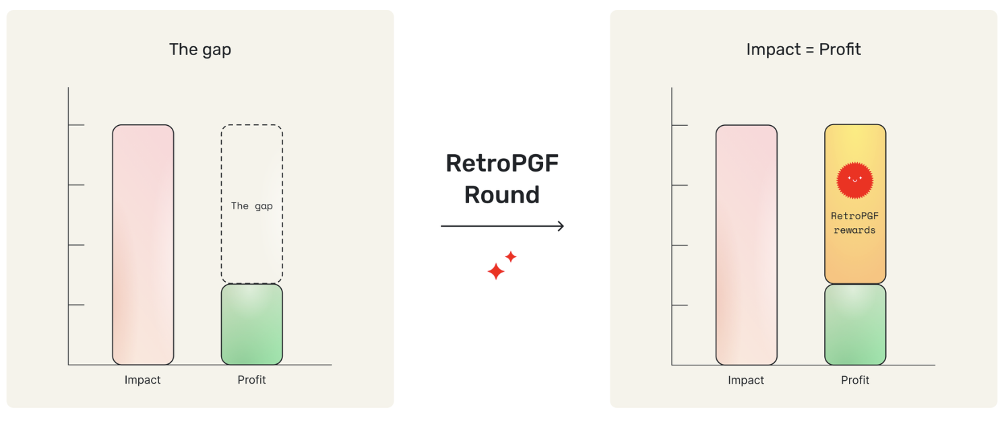

 
The Optimism Collective is a band of companies, communities, and citizens working together to reward public goods and build a sustainable future for Ethereum.

The Optimism Collective is bound by a mutually beneficial pact, [a vision](https://www.optimism.io/vision) that can be summed up with the axiom Impact=Profit. 
    
## Impact=Profit

The Optimism Collective's mission is to create an internet that benefits all and is owned by none. To do so, the Collective is creating a new economic paradigm, where impact is rewarded. The Collective calls this future [Ether’s Phoenix](https://optimism.mirror.xyz/x4LGFwa6RJ_opOaCOwr_VGk04Lp3of41H8ynWaFB27E).

## Governance Overview

The Optimism Collective and the Superchain take an experimental and agile approach to governance, relentlessly iterating towards a system which stands the test of time.

The Collective's model of digital democratic governance  consists of two houses: the *Token House* and the *Citizens' House*. These two houses form a bicameral governance system, with the two-house design intended to help the Collective make better decisions, avoid common pitfalls in token-based governance systems, and have checks and balances. 

**What is described here is an initial experiment**. The specifics of this system will evolve as the Collective grows.

### Token House

Governance of the Optimism Collective began with the launch of the OP token and the Token House. 

As Token House members, OP holders are responsible for submitting, deliberating, and voting on various types of governance proposals. 
In carrying out these functions, OP holders may either [vote directly, or delegate their OP voting power to someone else](https://community.optimism.io/docs/governance/howto-delegate/).

The Token House votes on on the proposal types outlined in the [Operating Manual](https://github.com/ethereum-optimism/OPerating-manual/blob/main/manual.md#valid-proposal-types).

You can learn more in the [Token House section](../token-house/README.md).
    
### Citizens' House

The Citizens' House is a large-scale experiment in reputation-based, one person = one vote governance, and is responsible for [Retroactive Public Goods Funding (Retro Funding)](https://medium.com/ethereum-optimism/retroactive-public-goods-funding-33c9b7d00f0c). 

Retro Funding is the primary economic engine for the Collective, rewarding those who create positive impact across the Collective and the Superchain. Retro Funding is based on the simple idea that it’s easier to agree on what was useful in the past than what might be useful in the future.

For more information about the Citizens' House, view the [Citizens' House section](https://community.optimism.io/docs/governance/citizens-house/).

For details about Retro Funding and future Retro Funing Rounds, visit [retrofunding.optimism.io](https://retrofunding.optimism.io/).

For details around identity and reputation in the Citizens' House, view [identity and reputation section](../identity/README.md). 

## How do these houses work together?
The Token House and the Citizens House work together to ensure the Collective achieves its vision. 

You can find a more detailed breakdown of responsibilities in this diagram.

You can find more information about the [The Future of Optimism Governance here](https://optimism.mirror.xyz/PLrAQgE1EGRo7GRrFoztplFChnUZda4DFGW3dkQayxY).

## Governing Documents

### The Collective's Working Constitution

[The Working Constitution](https://gov.optimism.io/t/working-constitution-of-the-optimism-collective/55) outlines governing provisions and principles for the Collective. It was adopted in April, 2022.

### The Collective's Operating Manual

The Collective’s [Operating Manual](https://github.com/ethereum-optimism/OPerating-manual/blob/main/manual.md) describes current governance processes for the Token House. It will evolve, with the Collective, over time. The version linked here, from [The Optimism Foundation's github repository](https://github.com/ethereum-optimism/OPerating-manual), is the authoritative one.